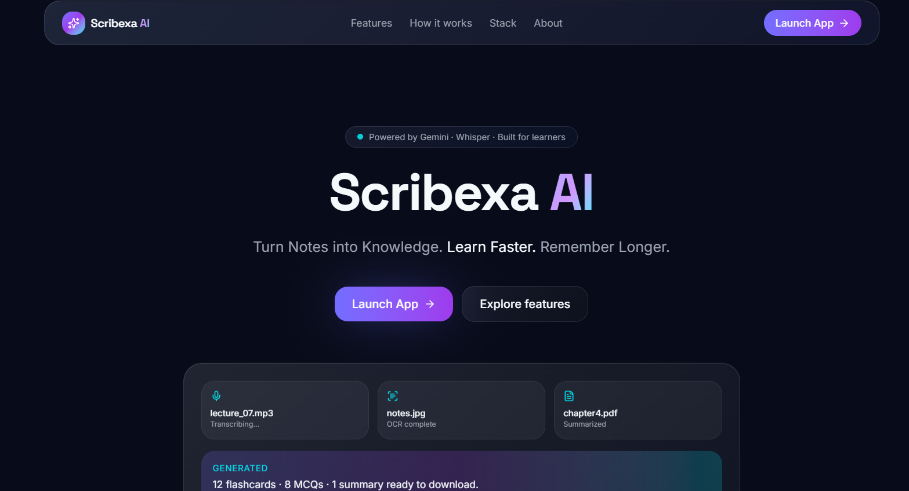
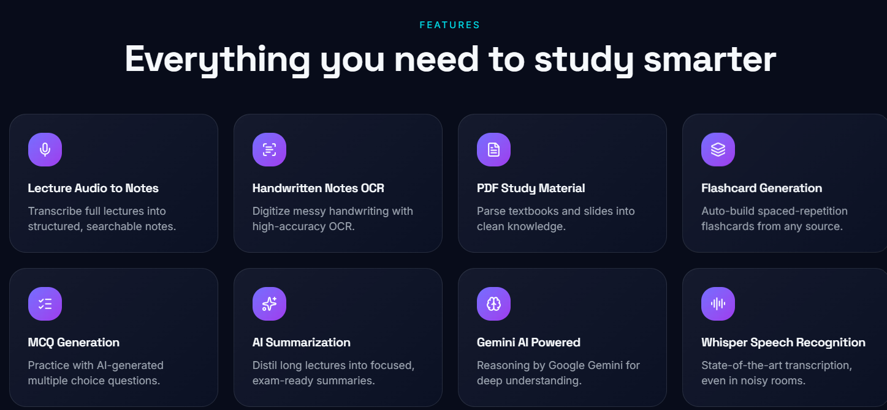
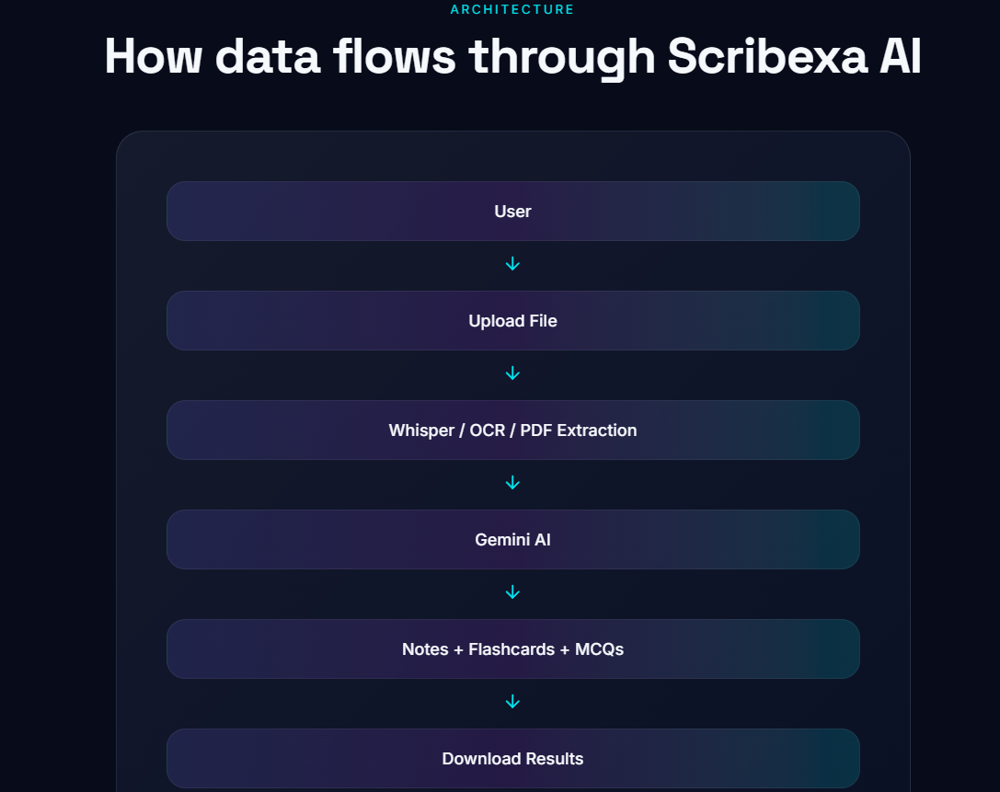

# 🚀 Scribexa AI Landing Page

Modern AI SaaS landing page for Scribexa AI.

### Tagline

Turn Notes into Knowledge. Learn Faster. Remember Longer.

---

## Overview

This landing page serves as the public-facing website for Scribexa AI and provides:

* Product Overview
* Feature Showcase
* How the main project works
* Technology Stack
* Developer Information
* Direct Access to the Application

---

## Live Links
Landing Page : 
(https://scribexa-ai-landing-page.lovable.app/)

Streamlit App:
(https://scribexa-ai-edunet-ibm.streamlit.app/)

---

## Features

* Modern SaaS Design
* Responsive Layout
* Smooth Animations
* Feature Showcase
* Architecture Overview
* Launch Application Button
* GitHub Integration

---

## Built With

* Lovable
* React
* TypeScript
* Tailwind CSS

---

## Project Structure
```
scribexa-ai-landing-page/
│
├── README.md
├── package.json
├── bun.lock
├── bunfig.toml
├── tsconfig.json
├── vite.config.ts
├── eslint.config.js
├── components.json
├── .gitignore
├── .prettierignore
├── .prettierrc
│
├── assets/
│   ├── landing-page.png
│   ├── features.png
│   ├── architecture.png
│
├── public/
│   ├── favicon.ico
│   ├── logo.png
│   └── robots.txt
│
├── src/
│   │
│   ├── routes/
│   │   ├── index.tsx
│   │   ├── features.tsx
│   │   ├── about.tsx
│   │   └── contact.tsx
│   │
│   ├── components/
│   │   ├── Hero.tsx
│   │   ├── Features.tsx
│   │   ├── Architecture.tsx
│   │   ├── Testimonials.tsx
│   │   ├── Footer.tsx
│   │   └── Navbar.tsx
│   │
│   ├── components/ui/
│   │   ├── button.tsx
│   │   ├── card.tsx
│   │   ├── dialog.tsx
│   │   ├── input.tsx
│   │   └── ...
│   │
│   ├── hooks/
│   │   └── use-mobile.tsx
│   │
│   ├── lib/
│   │   └── utils.ts
│   │
│   ├── styles.css
│   ├── router.tsx
│   ├── routeTree.gen.ts
│   ├── server.ts
│   └── start.ts
│
├── .lovable/
│   └── project.json
```

---
## 📷 Screenshots

### Landing Page



### Features Section



### Architecture Diagram



---

## Developer

Shobhan Satpathy
Computer Science Student | AI/ML Enthusiast | Full Stack Web Developer

GitHub:
(https://github.com/Shobhan-04)

LinkedIn:
(www.linkedin.com/in/shobhanengineer)

⭐ If you found this project useful, please star the repository.

---

## Related Repository

Main Project:
(https://github.com/Shobhan-04/scribexa-ai-edunet-ibm)
